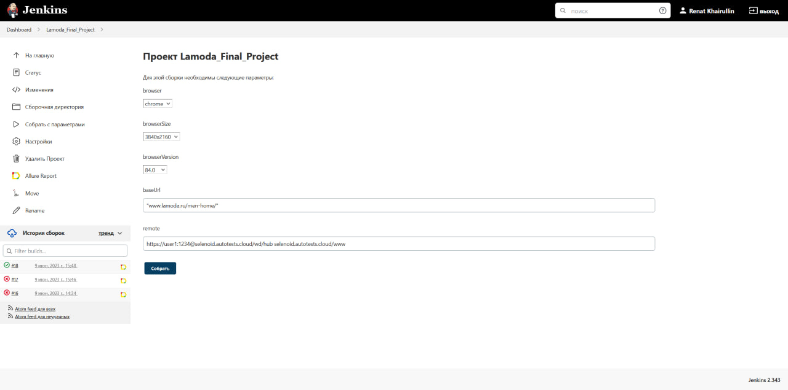
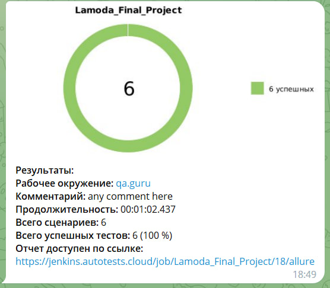
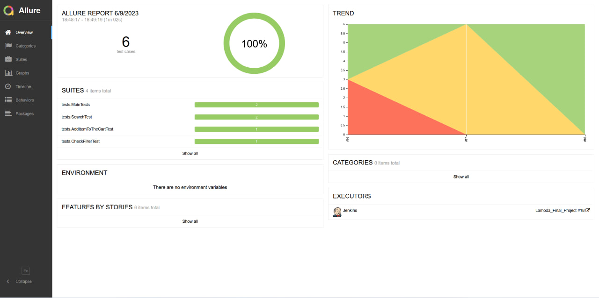
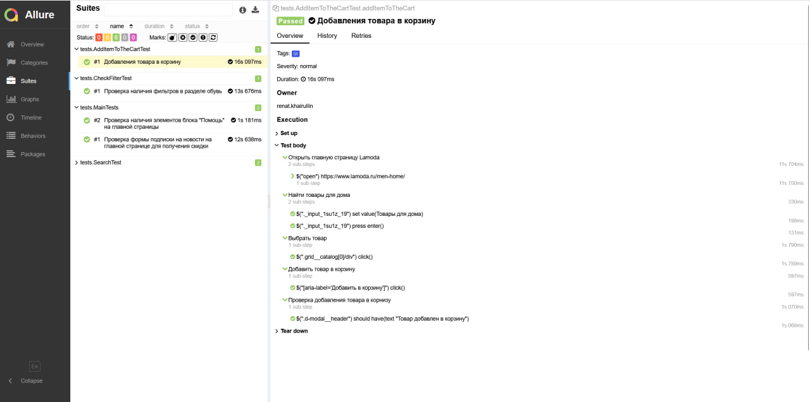

<h1 >Демопроект автоматизации тестирования на <a href="https://www.lamoda.ru/men-home/">Lamoda</a></h1>


## :page_with_curl: Содержание

* <a href="#tools">Технологии и инструменты</a>

* <a href="#cases">Реализованные проверки</a>

* <a href="#console">Запуск тестов из терминала</a>

* <a href="#jenkins">Запуск тестов в Jenkins</a>

* <a href="#telegram">Уведомления в Telegram</a>

* <a href="#allure">Allure Report отчеты</a>


<a id="tools"></a>
## Технологии и инструменты

| Java                                                                                                    | IntelliJ Idea                                                                                                                | Allure                                                                                                                    | GitHub                                                                                                    | JUnit 5                                                                                                           | Gradle                                                                                                   | REST Assured                                                                                                   |  Jenkins                                                                                                           |
|:--------------------------------------------------------------------------------------------------------|------------------------------------------------------------------------------------------------------------------------------|---------------------------------------------------------------------------------------------------------------------------|-------------------------------------------------------------------------------------------------------------|-------------------------------------------------------------------------------------------------------------------|----------------------------------------------------------------------------------------------------------|----------------------------------------------------------------------------------------------------------------|-------------------------------------------------------------------------------------------------------------------:|
| <a href="https://www.java.com/"></a> | <a id ="tech" href="https://www.jetbrains.com/idea/"></a> | <a href="https://github.com/allure-framework"></a> | <a href="https://github.com/"></a> | <a href="https://junit.org/junit5/"></a> | <a href="https://gradle.org/"></a> | <a href="https://rest-assured.io/"></a>  |   <a href="https://www.jenkins.io/"></a> |


<a id="cases"></a>
## :heavy_check_mark: Реализованные проверки

-  Добавления товара в корзину
-  Наличия элементов блока "Помощь" на главное странице
-  Проверка подписки на новости на главной странице
-  Проверка поиска товаров с главной страницы

<a id="console"></a>
##  Запуск тестов из терминала
### Локальный запуск тестов

```
clean ui_test  
```

<a id="jenkins"></a>
## </a> Запуск тестов в [Jenkins](https://jenkins.autotests.cloud/job/Lamoda_Final_Project/)

<p align="center">

> Для запуска необходимо нажать "Собрать c параметрами" и выбрать параметры для запуска Джобы.

<a href="https://jenkins.autotests.cloud/job/Lamoda_Final_Project/"></a>

<a id="telegram"></a>
## </a> Уведомления в Telegram

<p >

> С помощью настроенного бота после завершения прогона в Jenkins поступают уведомления в Telegram.


</p>

<a id="allure"></a>
## </a> [Allure Report](https://jenkins.autotests.cloud/job/Lamoda_Final_Project/18/allure/) отчеты

### Основное окно

<p align="center">

</p>

### Отчеты по тестам

<p align="center">

> В отчете по тестам присутствует развернутая информация.


</p>